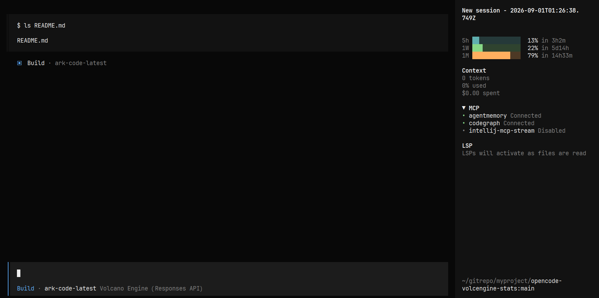

# opencode-volcengine-stats

[](https://github.com/overstart/opencode-volcengine-stats/actions/workflows/ci.yml)
[](https://github.com/overstart/opencode-volcengine-stats/actions/workflows/npm-publish.yml)
[](https://www.npmjs.com/package/opencode-volcengine-stats)
[](LICENSE)

[English](README.md)

一个 [OpenCode](https://opencode.ai) TUI 插件，在会话右侧栏显示**火山方舟
Coding Plan** 套餐用量（和自带的 context、mcp 面板一样，只在会话中出现，
首页不显示）：



数据来自本机 [`arkcli`](https://www.npmjs.com/package/@volcengine/ark-cli)
——插件本身不调用方舟 API、不处理鉴权。

## 安装

**前置条件：** 已安装并登录 `arkcli`，且在 `PATH` 上：

```bash
npm i -g @volcengine/ark-cli@latest
arkcli auth login
arkcli usage plan --product coding-plan --format json   # 自检
```

然后让 OpenCode 自动添加：

```bash
opencode plugin opencode-volcengine-stats        # 当前项目
opencode plugin opencode-volcengine-stats -g     # 全局（所有项目）
```

或手动写入 TUI 配置（全局 `~/.config/opencode/tui.json`，单项目
`<项目>/.opencode/tui.json`）后重启：

```json
{
  "$schema": "https://opencode.ai/tui.json",
  "plugin": ["opencode-volcengine-stats"]
}
```

> 这是 **TUI** 插件，通过 `tui.json` 加载，**不**走 `.opencode/plugins/`
> （那个目录放的是 *server* 插件）。

## 配置

选项通过 `plugin` 条目的第二个元素传入：

| 选项            | 默认值          | 含义                         |
|-----------------|-----------------|------------------------------|
| `product`       | `"coding-plan"` | arkcli 产品 id               |
| `bin`           | `"arkcli"`      | arkcli 二进制名称/路径       |
| `pollMs`        | `60000`         | 数据重新拉取间隔（毫秒）     |
| `barWidth`      | `14`            | 进度条轨道宽度（单元格）     |
| `showCountdown` | `true`          | 是否显示重置倒计时           |

```json
{
  "$schema": "https://opencode.ai/tui.json",
  "plugin": [["opencode-volcengine-stats", { "pollMs": 30000, "barWidth": 18 }]]
}
```

## 许可证

[MIT](LICENSE)
